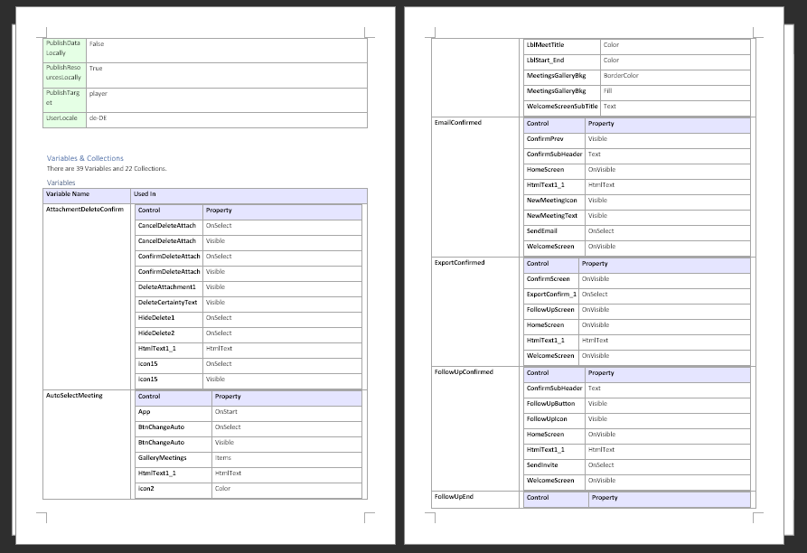
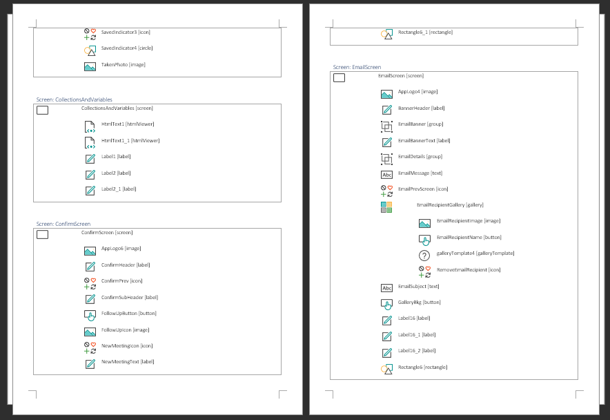
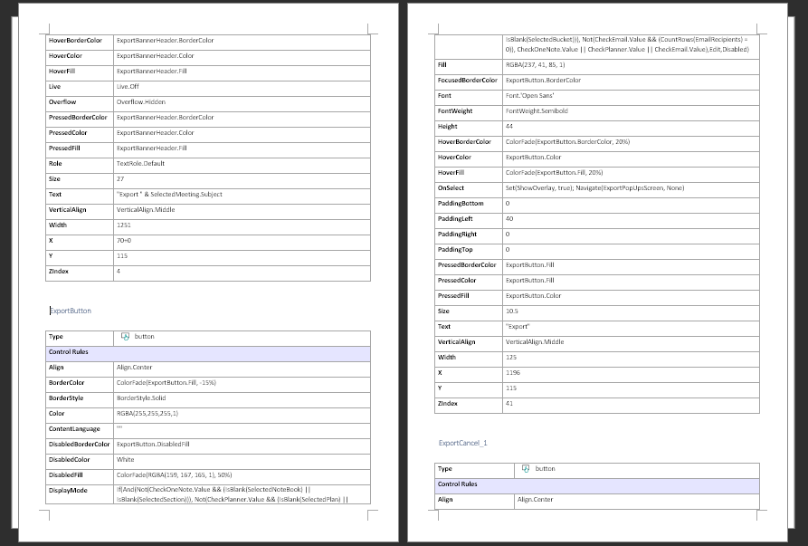

# PowerDocu
After you have built a Flow in Power Automate or a canvas app in Power Apps, you may consider documenting it as to allow others to get a better understanding of how it works, to ensure that any specific configuration in it is kept somewhere else as well, or for other reasons. However, manually documenting the technical implementation can be quite time consuming.

This is where **PowerDocu** can help!

PowerDocu contains two console applications called **FlowDocumenter** and **AppDocumenter**, as well as a graphical user interface to easily perform documentations. FlowDocumenter allows the automatic generation of technical documentation based on a provided exported Flow package or an exported Solution package, and AppDocumenter does the same for exported Power Apps canvas app. The GUI application handles both types.

**Example of a documented Flow:**

**Example of a documented Power App:**

## What is generated as part of the technical documentation?

The documentation for each Flow includes

1. A generated Word document including sections on
    1. General information of the Flow
    2. The connectors that are used by the Flow
    3. The Trigger that starts the Flow
    4. The actions used in the Flow
    5. A high-level and a detailed diagram of the Flow
2. PNG and SVG renditions of the high-level and details diagrams

The documentation for each canvas app includes

1. A generated Word document including sections on
    1. General information of the app and its properties
    2. The global variables and collections used in the app (and in which controls they are used)
    3. The Data Sources used
    4. The Resources used
    5. An overview of the various screens inside the app and the controls inside them
    6. A detailed list of all controls, together with all their properties

The documentation for a solution includes

1. Generated Word documents for each app inside the solution
2. Generated Word documents for each Flow inside the solution

> **_NOTE:_** AppDocumenter is currently in a **very early development stage**! It offers basic functionality, but has a lot of room for improvement. FlowDocumenter is considered to be mostly stable. If you find any bugs or other issues, please log an **[Issue](https://github.com/modery/PowerDocu/issues)** in this GitHub project. For any improvement recommendations and suggestions, please open a **[Discussion](https://github.com/modery/PowerDocu/discussions)**. Most importantly, if you want to contribute to this project's code, please fork this repository and submit appropriate Pull Requests. **Any kind of contribution is more than welcome!**

## How to use FlowDocumenter

Please refer to [Installation & Usage](installation.md) for information on how to install PowerDocu and how to use it to generate documentation.

## How does the generated documentation look like?

Please have a look at the [examples](examples/examples.md) provided.

## How can I help to improve PowerDocu?

If you can think of ways to improve it, here are some things that you can do:
1. If it is not working properly or if you find a bug, please log a detailed [Issue](https://github.com/modery/PowerDocu/issues)
2. If you have a suggestion on what could be added or what could be done better, please add it under **[Discussions](https://github.com/modery/PowerDocu/discussions)**. Also, please have a look at the existing discussions and add any comments you may have
3. Found some ugly code that should be improved? Got an idea for some additional functionality and want to implement it yourself? Please create a fork of this repo, make your changes, and submit a Pull Request!

## What other documentation options are there for the Power Platform?

- **PowerApps-docstring** is a console based, pipeline ready application that automatically generates user and technical documentation for PowerApps: https://github.com/sebastian-muthwill/powerapps-docstring
- **FlowToVisio**, a tool to create Visio representations of your Cloud Flows: https://github.com/LinkeD365/FlowToVisio