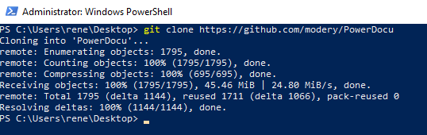
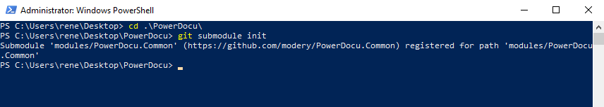
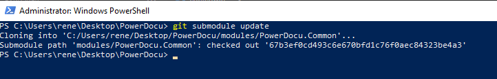
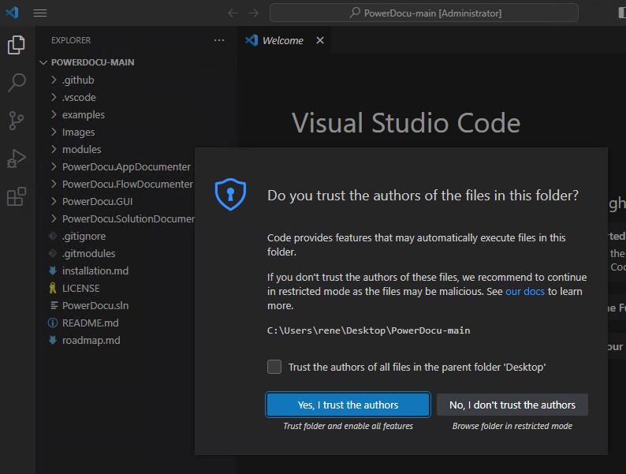

# How to compile PowerDocu

The information below is one possible way of compiling PowerDocu. Other options also exist, but are not further documented.

## Prerequisites
To compile PowerDocu, the following prerequisites need to be installed on your Windows machine:
* a latest .NET SDK (e.g. .NET 7) from https://aka.ms/dotnet/download  
* Git from https://git-scm.com/
* Visual Studio Code https://code.visualstudio.com/download
* Once VSCode has been installed, you need to add the C# extension: https://marketplace.visualstudio.com/items?itemName=ms-dotnettools.csharp

## Getting the PowerDocu Source Code
The following can be executed in a Command Prompt, PowerShell window, VSCode Terminal, and others:
Run the following command to get the latest version of the PowerDocu source code into a subfolder called "PowerDocu" inside the current directory

'''
git clone https://github.com/modery/PowerDocu
'''

Navigate into the PowerDocu folder

'''
cd PowerDocu
'''

Besides the PowerDocu code, you also need to get the PowerDocu.Common code which is inside a submodule. Do so by running these two commands:

'''
git submodule init
git submodule update
'''

## Opening PowerDocu in VSCode
1. Open the PowerDocu folder in Visual Studio Code
2. Trust the content
3. To build it, simply press F5 or select Run->Start Debugging

