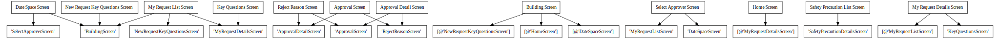

# Power App Documentation \- Building Access

| Property                   | Value                                   |
| -------------------------- | --------------------------------------- |
| App Name                   | Building Access                         |
| App Logo                   |  |
| Documentation generated at | Wednesday, 30 November 2022 10:20 am    |

- [Overview](index-Building-Access.md)
- [App Details](appdetails-Building-Access.md)
- [Variables](variables-Building-Access.md)
- [DataSources](datasources-Building-Access.md)
- [Resources](resources-Building-Access.md)
- [Controls](controls-Building-Access.md)

## Controls Overview

A total of 13 Screens are located in the app.

A total of 325 Controls are located in the app.

### [Screen: Approval Detail Screen](screen-Approval-Detail-Screen-Building-Access.md)

- [ Approval Detail Screen](screen-Approval-Detail-Screen-Building-Access.md)
- - [ btnCancelReject](screen-Approval-Detail-Screen-Building-Access.md)
- - [ btnReject](screen-Approval-Detail-Screen-Building-Access.md)
- - [ btnRequestApprove](screen-Approval-Detail-Screen-Building-Access.md)
- - [ btnRequestReject](screen-Approval-Detail-Screen-Building-Access.md)
- - [ BuildingCardApprovalDetail](screen-Approval-Detail-Screen-Building-Access.md)
- - [ ctrlRejectionReasonApprovalDetail](screen-Approval-Detail-Screen-Building-Access.md)
- - [ grpErrorMessage\_3](screen-Approval-Detail-Screen-Building-Access.md)
- - [ HeaderControlApprovalRequestDetails](screen-Approval-Detail-Screen-Building-Access.md)
- - [ icnErrorCancel\_3](screen-Approval-Detail-Screen-Building-Access.md)
- - [ imgApprovalBackApprovalDetail](screen-Approval-Detail-Screen-Building-Access.md)
- - [ imgBuildingDetailsBorder](screen-Approval-Detail-Screen-Building-Access.md)
- - [ imgErrorInfo\_3](screen-Approval-Detail-Screen-Building-Access.md)
- - [ imgReasonAccessBorder](screen-Approval-Detail-Screen-Building-Access.md)
- - [ lblErrorBackRectangle\_3](screen-Approval-Detail-Screen-Building-Access.md)
- - [ lblErrorMessage\_3](screen-Approval-Detail-Screen-Building-Access.md)
- - [ lblErrorRectangle\_3](screen-Approval-Detail-Screen-Building-Access.md)
- - [ rctAlertBackDropApprovalDetail](screen-Approval-Detail-Screen-Building-Access.md)
- - [ SeperatorFeedApprovalDetail](screen-Approval-Detail-Screen-Building-Access.md)
- - [ shpRectangleBackGround\_ApprovalDetailScreen](screen-Approval-Detail-Screen-Building-Access.md)
- - [ shpUpperRectangle\_ApprovalDetailScreen](screen-Approval-Detail-Screen-Building-Access.md)

### [Screen: Approval Screen](screen-Approval-Screen-Building-Access.md)

- [ Approval Screen](screen-Approval-Screen-Building-Access.md)
- - [ AlertBackDrop](screen-Approval-Screen-Building-Access.md)
- - [ btnApproveSelected](screen-Approval-Screen-Building-Access.md)
- - [ btnCancel](screen-Approval-Screen-Building-Access.md)
- - [ btnRejectApproval](screen-Approval-Screen-Building-Access.md)
- - [ btnRejectSelected](screen-Approval-Screen-Building-Access.md)
- - [ chkSelectAll](screen-Approval-Screen-Building-Access.md)
- - [ ctrlRejectionReason](screen-Approval-Screen-Building-Access.md)
- - [ glryApprovals](screen-Approval-Screen-Building-Access.md)
  - - [ chkSelectRequest](screen-Approval-Screen-Building-Access.md)
  - - [ galleryTemplate1](screen-Approval-Screen-Building-Access.md)
  - - [ icnInformation](screen-Approval-Screen-Building-Access.md)
  - - [ imgInfo](screen-Approval-Screen-Building-Access.md)
  - - [ lblRequestor](screen-Approval-Screen-Building-Access.md)
  - - [ lblRequestTitle](screen-Approval-Screen-Building-Access.md)
  - - [ lblTitle](screen-Approval-Screen-Building-Access.md)
  - - [ requestSeparator](screen-Approval-Screen-Building-Access.md)
- - [ grpErrorMessage\_1](screen-Approval-Screen-Building-Access.md)
- - [ HeaderControlApproval](screen-Approval-Screen-Building-Access.md)
- - [ icnErrorCancel\_1](screen-Approval-Screen-Building-Access.md)
- - [ icnFilter](screen-Approval-Screen-Building-Access.md)
- - [ icnSearchApproval](screen-Approval-Screen-Building-Access.md)
- - [ imgApprovalBack](screen-Approval-Screen-Building-Access.md)
- - [ imgErrorInfo\_1](screen-Approval-Screen-Building-Access.md)
- - [ imgGalleryApprovalsBorder](screen-Approval-Screen-Building-Access.md)
- - [ lblErrorBackRectangle\_1](screen-Approval-Screen-Building-Access.md)
- - [ lblErrorMessage\_1](screen-Approval-Screen-Building-Access.md)
- - [ lblErrorRectangle\_1](screen-Approval-Screen-Building-Access.md)
- - [ lblSelectAll](screen-Approval-Screen-Building-Access.md)
- - [ rctRejectApproved](screen-Approval-Screen-Building-Access.md)
- - [ SeperatorFeedApproval](screen-Approval-Screen-Building-Access.md)
- - [ shpRectangleBackGround\_ApprovalScreen](screen-Approval-Screen-Building-Access.md)
- - [ shpUpperRectangle\_ApprovalScreen](screen-Approval-Screen-Building-Access.md)
- - [ txtApprovalsSearch](screen-Approval-Screen-Building-Access.md)

### [Screen: Building Screen](screen-Building-Screen-Building-Access.md)

- [ Building Screen](screen-Building-Screen-Building-Access.md)
- - [ btnBackBuildingScreen](screen-Building-Screen-Building-Access.md)
- - [ btnSave&NextBuildingScreen](screen-Building-Screen-Building-Access.md)
- - [ cmbSelectBuilding](screen-Building-Screen-Building-Access.md)
- - [ grpBusinessReason](screen-Building-Screen-Building-Access.md)
- - [ grpEligibilityCriteria.](screen-Building-Screen-Building-Access.md)
- - [ grpSelectBuilding](screen-Building-Screen-Building-Access.md)
- - [ HeaderControlSelectBuilding](screen-Building-Screen-Building-Access.md)
- - [ htmlEligibilityText](screen-Building-Screen-Building-Access.md)
- - [ lblBusinessReason](screen-Building-Screen-Building-Access.md)
- - [ lblEligibility](screen-Building-Screen-Building-Access.md)
- - [ lblSelectBuilding](screen-Building-Screen-Building-Access.md)
- - [ lblSelectBuildingHeader](screen-Building-Screen-Building-Access.md)
- - [ NavigationComponentSelectBuilding](screen-Building-Screen-Building-Access.md)
- - [ shpBuildingSeparator](screen-Building-Screen-Building-Access.md)
- - [ shpReasonSeparator](screen-Building-Screen-Building-Access.md)
- - [ shpRectangleBackGround\_BuildingScreen](screen-Building-Screen-Building-Access.md)
- - [ shpUpperRectangle\_BuildingScreen](screen-Building-Screen-Building-Access.md)
- - [ txtBusinessReason](screen-Building-Screen-Building-Access.md)
- - [ txtEligibilityCriteria](screen-Building-Screen-Building-Access.md)

### [Screen: Date Space Screen](screen-Date-Space-Screen-Building-Access.md)

- [ Date Space Screen](screen-Date-Space-Screen-Building-Access.md)
- - [ btnBackDateScreen](screen-Date-Space-Screen-Building-Access.md)
- - [ btnSave&NextDateScreen](screen-Date-Space-Screen-Building-Access.md)
- - [ DateSpaceCanvas](screen-Date-Space-Screen-Building-Access.md)
  - - [ DateSpaceDataCard](screen-Date-Space-Screen-Building-Access.md)
    - - [ btnCheckAvailability](screen-Date-Space-Screen-Building-Access.md)
    - - [ cmbSelectSlot](screen-Date-Space-Screen-Building-Access.md)
    - - [ cmbSelectSpace](screen-Date-Space-Screen-Building-Access.md)
    - - [ datepkEndDate](screen-Date-Space-Screen-Building-Access.md)
    - - [ datepkStartDate](screen-Date-Space-Screen-Building-Access.md)
    - - [ glryAvailableDate&Space](screen-Date-Space-Screen-Building-Access.md)
      - - [ galleryTemplate4\_2](screen-Date-Space-Screen-Building-Access.md)
      - - [ icnNextArrow2](screen-Date-Space-Screen-Building-Access.md)
      - - [ imgDown2](screen-Date-Space-Screen-Building-Access.md)
      - - [ lblBuildingTitle2](screen-Date-Space-Screen-Building-Access.md)
      - - [ lblDateExtra](screen-Date-Space-Screen-Building-Access.md)
      - - [ lblSpaceName2](screen-Date-Space-Screen-Building-Access.md)
      - - [ lblTimeSlotExtra](screen-Date-Space-Screen-Building-Access.md)
      - - [ shpAvailableDateGalleryRectangle](screen-Date-Space-Screen-Building-Access.md)
    - - [ glryReservedDate&Space](screen-Date-Space-Screen-Building-Access.md)
      - - [ galleryTemplate5\_2](screen-Date-Space-Screen-Building-Access.md)
      - - [ icnNextArrow](screen-Date-Space-Screen-Building-Access.md)
      - - [ imgDown](screen-Date-Space-Screen-Building-Access.md)
      - - [ lblBuildingTitle](screen-Date-Space-Screen-Building-Access.md)
      - - [ lblSpaceName](screen-Date-Space-Screen-Building-Access.md)
      - - [ lblTimeSlotValue](screen-Date-Space-Screen-Building-Access.md)
      - - [ shpReservedDateGalleryRectangle](screen-Date-Space-Screen-Building-Access.md)
    - - [ glryReservedSpace](screen-Date-Space-Screen-Building-Access.md)
      - - [ galleryTemplate3](screen-Date-Space-Screen-Building-Access.md)
      - - [ Title2](screen-Date-Space-Screen-Building-Access.md)
    - - [ grpEndDate](screen-Date-Space-Screen-Building-Access.md)
    - - [ grpSelectSlot](screen-Date-Space-Screen-Building-Access.md)
    - - [ grpSelectSpace](screen-Date-Space-Screen-Building-Access.md)
    - - [ grpStartDate](screen-Date-Space-Screen-Building-Access.md)
    - - [ lblDateAndSpaceError](screen-Date-Space-Screen-Building-Access.md)
    - - [ lblEndDate](screen-Date-Space-Screen-Building-Access.md)
    - - [ lblReservedSpaces](screen-Date-Space-Screen-Building-Access.md)
    - - [ lblSelectDate\/SpaceHeader](screen-Date-Space-Screen-Building-Access.md)
    - - [ lblSelectedDateAndSpace](screen-Date-Space-Screen-Building-Access.md)
    - - [ lblSelectSlot](screen-Date-Space-Screen-Building-Access.md)
    - - [ lblSelectSpace](screen-Date-Space-Screen-Building-Access.md)
    - - [ lblStartDate](screen-Date-Space-Screen-Building-Access.md)
    - - [ lblTimeSlotError](screen-Date-Space-Screen-Building-Access.md)
    - - [ lblToggleButton](screen-Date-Space-Screen-Building-Access.md)
    - - [ shpEndDateSeparator](screen-Date-Space-Screen-Building-Access.md)
    - - [ shpRectangleExtra](screen-Date-Space-Screen-Building-Access.md)
    - - [ shpSlotSeparator](screen-Date-Space-Screen-Building-Access.md)
    - - [ shpSpaceSeparator](screen-Date-Space-Screen-Building-Access.md)
    - - [ shpStartDateSeparator](screen-Date-Space-Screen-Building-Access.md)
    - - [ togDay](screen-Date-Space-Screen-Building-Access.md)
- - [ HeaderControlSelectDateAndSpace](screen-Date-Space-Screen-Building-Access.md)
- - [ icnErrorCancel\_4](screen-Date-Space-Screen-Building-Access.md)
- - [ imgErrorInfo\_4](screen-Date-Space-Screen-Building-Access.md)
- - [ lblErrorBackRectangle\_4](screen-Date-Space-Screen-Building-Access.md)
- - [ lblErrorMessage\_4](screen-Date-Space-Screen-Building-Access.md)
- - [ lblErrorRectangle\_4](screen-Date-Space-Screen-Building-Access.md)
- - [ NavigationComponentSelectDateAndSpace](screen-Date-Space-Screen-Building-Access.md)
- - [ shpRectangleBackGround\_DateSpaceScreen](screen-Date-Space-Screen-Building-Access.md)
- - [ shpUpperRectangle\_DateSpaceScreen](screen-Date-Space-Screen-Building-Access.md)

### [Screen: Home Screen](screen-Home-Screen-Building-Access.md)

- [ Home Screen](screen-Home-Screen-Building-Access.md)
- - [ glryReservation](screen-Home-Screen-Building-Access.md)
  - - [ galleryTemplate7\_1](screen-Home-Screen-Building-Access.md)
  - - [ imgArrow](screen-Home-Screen-Building-Access.md)
  - - [ lblBuildingInfo](screen-Home-Screen-Building-Access.md)
  - - [ lblTimeSlot](screen-Home-Screen-Building-Access.md)
  - - [ rectReservation](screen-Home-Screen-Building-Access.md)
- - [ HomePageMenus](screen-Home-Screen-Building-Access.md)
- - [ icnReload](screen-Home-Screen-Building-Access.md)
- - [ lblTodaysReservation](screen-Home-Screen-Building-Access.md)
- - [ lblUserDescription](screen-Home-Screen-Building-Access.md)
- - [ lblUserTitle](screen-Home-Screen-Building-Access.md)
- - [ shpRectangleBackGround\_HomeScreen](screen-Home-Screen-Building-Access.md)
- - [ shpSeparatorRectangle](screen-Home-Screen-Building-Access.md)
- - [ shpUpperRectangle\_HomeScreen](screen-Home-Screen-Building-Access.md)

### [Screen: Key Questions Screen](screen-Key-Questions-Screen-Building-Access.md)

- [ Key Questions Screen](screen-Key-Questions-Screen-Building-Access.md)
- - [ btnSubmitKeyQuestions](screen-Key-Questions-Screen-Building-Access.md)
- - [ grpErrorMessage\_KeyquestionsScreen](screen-Key-Questions-Screen-Building-Access.md)
- - [ HeaderControlKeyEligibilityQuestions](screen-Key-Questions-Screen-Building-Access.md)
- - [ htmlErrorMessage\_KeyquestionsScreens](screen-Key-Questions-Screen-Building-Access.md)
- - [ icnErrorCancel\_KeyquestionsScreen](screen-Key-Questions-Screen-Building-Access.md)
- - [ imgErrorInfo\_KeyquestionsScreen](screen-Key-Questions-Screen-Building-Access.md)
- - [ KeyQuestionsListComponent](screen-Key-Questions-Screen-Building-Access.md)
- - [ lblErrorBackRectangle\_KeyquestionsScreen](screen-Key-Questions-Screen-Building-Access.md)
- - [ lblErrorMessage\_KeyquestionsScreen](screen-Key-Questions-Screen-Building-Access.md)
- - [ lblErrorRectangle\_KeyquestionsScreen](screen-Key-Questions-Screen-Building-Access.md)
- - [ shpRectangleBackGround\_KeyQuestionsScreen](screen-Key-Questions-Screen-Building-Access.md)
- - [ shpUpperRectangle\_KeyQuestionsScreen](screen-Key-Questions-Screen-Building-Access.md)

### [Screen: My Request Details Screen](screen-My-Request-Details-Screen-Building-Access.md)

- [ My Request Details Screen](screen-My-Request-Details-Screen-Building-Access.md)
- - [ btnCheckIn](screen-My-Request-Details-Screen-Building-Access.md)
- - [ btnCheckOut](screen-My-Request-Details-Screen-Building-Access.md)
- - [ btnNo](screen-My-Request-Details-Screen-Building-Access.md)
- - [ btnWithdraw](screen-My-Request-Details-Screen-Building-Access.md)
- - [ btnYes](screen-My-Request-Details-Screen-Building-Access.md)
- - [ GrpCheckInCheckOut](screen-My-Request-Details-Screen-Building-Access.md)
- - [ grpCheckInSuccessMessage](screen-My-Request-Details-Screen-Building-Access.md)
- - [ grpCheckOutSuccessMessage](screen-My-Request-Details-Screen-Building-Access.md)
- - [ GrpWithdrawAlert](screen-My-Request-Details-Screen-Building-Access.md)
- - [ HeaderControlRequestDetails](screen-My-Request-Details-Screen-Building-Access.md)
- - [ icnErrorCancel\_5](screen-My-Request-Details-Screen-Building-Access.md)
- - [ icnErrorCancel\_KeyquestionsScreen\_1](screen-My-Request-Details-Screen-Building-Access.md)
- - [ imgErrorInfo\_5](screen-My-Request-Details-Screen-Building-Access.md)
- - [ imgErrorInfo\_KeyquestionsScreen\_1](screen-My-Request-Details-Screen-Building-Access.md)
- - [ lblAlertText](screen-My-Request-Details-Screen-Building-Access.md)
- - [ lblAlertTitle](screen-My-Request-Details-Screen-Building-Access.md)
- - [ lblCheckInTime](screen-My-Request-Details-Screen-Building-Access.md)
- - [ lblCheckOutTime](screen-My-Request-Details-Screen-Building-Access.md)
- - [ lblErrorBackRectangle\_5](screen-My-Request-Details-Screen-Building-Access.md)
- - [ lblErrorBackRectangle\_KeyquestionsScreen\_1](screen-My-Request-Details-Screen-Building-Access.md)
- - [ lblErrorMessage\_5](screen-My-Request-Details-Screen-Building-Access.md)
- - [ lblErrorMessage\_KeyquestionsScreen\_1](screen-My-Request-Details-Screen-Building-Access.md)
- - [ lblErrorRectangle\_5](screen-My-Request-Details-Screen-Building-Access.md)
- - [ lblErrorRectangle\_KeyquestionsScreen\_1](screen-My-Request-Details-Screen-Building-Access.md)
- - [ rectBackDrop](screen-My-Request-Details-Screen-Building-Access.md)
- - [ rectOptionsBox](screen-My-Request-Details-Screen-Building-Access.md)
- - [ rectPopupBox](screen-My-Request-Details-Screen-Building-Access.md)
- - [ RequestDetailsCanvas](screen-My-Request-Details-Screen-Building-Access.md)
  - - [ RequestDetailsDataCard](screen-My-Request-Details-Screen-Building-Access.md)
    - - [ htmlOnsiteText](screen-My-Request-Details-Screen-Building-Access.md)
    - - [ lblMyRequestApprover](screen-My-Request-Details-Screen-Building-Access.md)
    - - [ lblMyRequestApproverValue](screen-My-Request-Details-Screen-Building-Access.md)
    - - [ lblMyRequestBusinessJustification](screen-My-Request-Details-Screen-Building-Access.md)
    - - [ lblMyRequestBusinessJustificationValue](screen-My-Request-Details-Screen-Building-Access.md)
    - - [ lblMyRequestCheckInStatus](screen-My-Request-Details-Screen-Building-Access.md)
    - - [ lblMyRequestCheckInStatusValue](screen-My-Request-Details-Screen-Building-Access.md)
    - - [ lblMyRequestDate](screen-My-Request-Details-Screen-Building-Access.md)
    - - [ lblMyRequestDateValue](screen-My-Request-Details-Screen-Building-Access.md)
    - - [ lblMyRequestInstructions](screen-My-Request-Details-Screen-Building-Access.md)
    - - [ lblMyRequestInstructionsValue](screen-My-Request-Details-Screen-Building-Access.md)
    - - [ lblMyRequestStatus](screen-My-Request-Details-Screen-Building-Access.md)
    - - [ lblMyRequestStatusValue](screen-My-Request-Details-Screen-Building-Access.md)
    - - [ lblReservedTime](screen-My-Request-Details-Screen-Building-Access.md)
    - - [ lblReservedTimeValue](screen-My-Request-Details-Screen-Building-Access.md)
    - - [ lblSeats](screen-My-Request-Details-Screen-Building-Access.md)
    - - [ lblSeatsValue](screen-My-Request-Details-Screen-Building-Access.md)
    - - [ lblTypeOfFacility](screen-My-Request-Details-Screen-Building-Access.md)
    - - [ lblTypeOfFacilityValue](screen-My-Request-Details-Screen-Building-Access.md)
- - [ RequestQRCode](screen-My-Request-Details-Screen-Building-Access.md)
- - [ shpRectangleBackGround\_MyRequestDetailsScreen](screen-My-Request-Details-Screen-Building-Access.md)
- - [ shpUpperRectangle\_MyRequestDetailsScreen](screen-My-Request-Details-Screen-Building-Access.md)

### [Screen: My Request List Screen](screen-My-Request-List-Screen-Building-Access.md)

- [ My Request List Screen](screen-My-Request-List-Screen-Building-Access.md)
- - [ btnSaveKeyQuestions\_1](screen-My-Request-List-Screen-Building-Access.md)
- - [ glryMyRequest](screen-My-Request-List-Screen-Building-Access.md)
  - - [ galleryTemplate6\_1](screen-My-Request-List-Screen-Building-Access.md)
  - - [ imgInformation](screen-My-Request-List-Screen-Building-Access.md)
  - - [ imgRequests](screen-My-Request-List-Screen-Building-Access.md)
  - - [ lblRequestStatus](screen-My-Request-List-Screen-Building-Access.md)
  - - [ lblUserRequestTitle](screen-My-Request-List-Screen-Building-Access.md)
  - - [ rctUserRequest](screen-My-Request-List-Screen-Building-Access.md)
- - [ HeaderControlMyRequestList](screen-My-Request-List-Screen-Building-Access.md)
- - [ icnSearchRequests](screen-My-Request-List-Screen-Building-Access.md)
- - [ shpRectangleBackGround\_MyRequestListScreen](screen-My-Request-List-Screen-Building-Access.md)
- - [ shpUpperRectangle\_MyRequestListScreen](screen-My-Request-List-Screen-Building-Access.md)
- - [ txtSearchRequestBox](screen-My-Request-List-Screen-Building-Access.md)

### [Screen: New Request Key Questions Screen](screen-New-Request-Key-Questions-Screen-Building-Access.md)

- [ New Request Key Questions Screen](screen-New-Request-Key-Questions-Screen-Building-Access.md)
- - [ btnSaveKeyQuestions](screen-New-Request-Key-Questions-Screen-Building-Access.md)
- - [ grpErrorMessage](screen-New-Request-Key-Questions-Screen-Building-Access.md)
- - [ HeaderControlKeyQuestions](screen-New-Request-Key-Questions-Screen-Building-Access.md)
- - [ htmlLblErrorMsg](screen-New-Request-Key-Questions-Screen-Building-Access.md)
- - [ icnErrorCancel](screen-New-Request-Key-Questions-Screen-Building-Access.md)
- - [ imgErrorInfo](screen-New-Request-Key-Questions-Screen-Building-Access.md)
- - [ KeyQuestionAnswers](screen-New-Request-Key-Questions-Screen-Building-Access.md)
- - [ lblErrorBackRectangle](screen-New-Request-Key-Questions-Screen-Building-Access.md)
- - [ lblErrorRectangle](screen-New-Request-Key-Questions-Screen-Building-Access.md)
- - [ lblKeyQuestionsHeader](screen-New-Request-Key-Questions-Screen-Building-Access.md)
- - [ NavigationKeyQuestions](screen-New-Request-Key-Questions-Screen-Building-Access.md)
- - [ shpRectangleBackGround\_NewRequestKeyQuestionsScreen](screen-New-Request-Key-Questions-Screen-Building-Access.md)
- - [ shpUpperRectangle\_NewRequestKeyQuestionsScreen](screen-New-Request-Key-Questions-Screen-Building-Access.md)

### [Screen: Reject Reason Screen](screen-Reject-Reason-Screen-Building-Access.md)

- [ Reject Reason Screen](screen-Reject-Reason-Screen-Building-Access.md)
- - [ btnCancelRequest](screen-Reject-Reason-Screen-Building-Access.md)
- - [ btnRejectRequest](screen-Reject-Reason-Screen-Building-Access.md)
- - [ grpErrorMessage\_2](screen-Reject-Reason-Screen-Building-Access.md)
- - [ HeaderControlRejectionReason](screen-Reject-Reason-Screen-Building-Access.md)
- - [ icnErrorCancel\_2](screen-Reject-Reason-Screen-Building-Access.md)
- - [ imgErrorInfo\_2](screen-Reject-Reason-Screen-Building-Access.md)
- - [ lblErrorBackRectangle\_2](screen-Reject-Reason-Screen-Building-Access.md)
- - [ lblErrorMessage\_2](screen-Reject-Reason-Screen-Building-Access.md)
- - [ lblErrorRectangle\_2](screen-Reject-Reason-Screen-Building-Access.md)
- - [ RejectionReasonComponent](screen-Reject-Reason-Screen-Building-Access.md)
- - [ shpRectangleBackGround\_RejectReasonScreen](screen-Reject-Reason-Screen-Building-Access.md)
- - [ shpUpperRectangle\_RejectReasonScreen](screen-Reject-Reason-Screen-Building-Access.md)

### [Screen: Safety Precaution Details Screen](screen-Safety-Precaution-Details-Screen-Building-Access.md)

- [ Safety Precaution Details Screen](screen-Safety-Precaution-Details-Screen-Building-Access.md)
- - [ glrySafetyPrecautionDetails](screen-Safety-Precaution-Details-Screen-Building-Access.md)
  - - [ galleryTemplate4\_1](screen-Safety-Precaution-Details-Screen-Building-Access.md)
  - - [ imgUpdatedStatusClock](screen-Safety-Precaution-Details-Screen-Building-Access.md)
  - - [ lblCountrySafetyPrecaution](screen-Safety-Precaution-Details-Screen-Building-Access.md)
  - - [ lblDescriptionSafetyPrecaution](screen-Safety-Precaution-Details-Screen-Building-Access.md)
  - - [ lblDescriptionSafetyPrecautions](screen-Safety-Precaution-Details-Screen-Building-Access.md)
  - - [ lblLastUpdatedSafetyPrecaution](screen-Safety-Precaution-Details-Screen-Building-Access.md)
  - - [ lblSafetyPrecautionTitleSafetyPrecaution](screen-Safety-Precaution-Details-Screen-Building-Access.md)
- - [ HeaderControlSafetyPrecautionsDetails](screen-Safety-Precaution-Details-Screen-Building-Access.md)
- - [ shpRectangleBackGround\_SafetyPrecautionDetailsScreen](screen-Safety-Precaution-Details-Screen-Building-Access.md)
- - [ shpUpperRectangle\_SafetyPrecautionDetailsScreen](screen-Safety-Precaution-Details-Screen-Building-Access.md)

### [Screen: Safety Precaution List Screen](screen-Safety-Precaution-List-Screen-Building-Access.md)

- [ Safety Precaution List Screen](screen-Safety-Precaution-List-Screen-Building-Access.md)
- - [ glrySafetyPrecautions.](screen-Safety-Precaution-List-Screen-Building-Access.md)
  - - [ galleryTemplate5\_3](screen-Safety-Precaution-List-Screen-Building-Access.md)
  - - [ htmlLblDescription](screen-Safety-Precaution-List-Screen-Building-Access.md)
  - - [ imgClock](screen-Safety-Precaution-List-Screen-Building-Access.md)
  - - [ imgRightArrow](screen-Safety-Precaution-List-Screen-Building-Access.md)
  - - [ lblCountry](screen-Safety-Precaution-List-Screen-Building-Access.md)
  - - [ lblDescription](screen-Safety-Precaution-List-Screen-Building-Access.md)
  - - [ lblLastUpdated](screen-Safety-Precaution-List-Screen-Building-Access.md)
  - - [ lblSafetyPrecautionTitle](screen-Safety-Precaution-List-Screen-Building-Access.md)
  - - [ precautionSeparator](screen-Safety-Precaution-List-Screen-Building-Access.md)
  - - [ shpRectangleBackground](screen-Safety-Precaution-List-Screen-Building-Access.md)
  - - [ shpRectangleBackground\_1](screen-Safety-Precaution-List-Screen-Building-Access.md)
- - [ HeaderControlSafetyPrecautions](screen-Safety-Precaution-List-Screen-Building-Access.md)
- - [ icnSearch](screen-Safety-Precaution-List-Screen-Building-Access.md)
- - [ shpRectangleBackGround\_SafetyPrecautionListScreen](screen-Safety-Precaution-List-Screen-Building-Access.md)
- - [ shpUpperRectangle\_SafetyPrecautionListScreen](screen-Safety-Precaution-List-Screen-Building-Access.md)
- - [ txtSearchBox](screen-Safety-Precaution-List-Screen-Building-Access.md)

### [Screen: Select Approver Screen](screen-Select-Approver-Screen-Building-Access.md)

- [ Select Approver Screen](screen-Select-Approver-Screen-Building-Access.md)
- - [ btnBackApproverScreen](screen-Select-Approver-Screen-Building-Access.md)
- - [ btnSave&NextApproverScreen](screen-Select-Approver-Screen-Building-Access.md)
- - [ chkSetDefaultApprover](screen-Select-Approver-Screen-Building-Access.md)
- - [ glryRequiredDate&Space](screen-Select-Approver-Screen-Building-Access.md)
  - - [ galleryTemplate4\_3](screen-Select-Approver-Screen-Building-Access.md)
  - - [ icnNextArrow3](screen-Select-Approver-Screen-Building-Access.md)
  - - [ imgDown3](screen-Select-Approver-Screen-Building-Access.md)
  - - [ lblBuildingTitle3](screen-Select-Approver-Screen-Building-Access.md)
  - - [ lblDateExtra1](screen-Select-Approver-Screen-Building-Access.md)
  - - [ lblSpaceName3](screen-Select-Approver-Screen-Building-Access.md)
  - - [ lblTimeSlotExtra1](screen-Select-Approver-Screen-Building-Access.md)
  - - [ shpRequiredDateGalleryRectangle](screen-Select-Approver-Screen-Building-Access.md)
- - [ grpAlternateApprover](screen-Select-Approver-Screen-Building-Access.md)
- - [ grpDefaultApprover](screen-Select-Approver-Screen-Building-Access.md)
- - [ grpErrorMessage\_ApproverScreen](screen-Select-Approver-Screen-Building-Access.md)
- - [ HeaderControlSelectApprover](screen-Select-Approver-Screen-Building-Access.md)
- - [ icnErrorCancel\_ApproverScreen](screen-Select-Approver-Screen-Building-Access.md)
- - [ imgErrorInfo\_ApproverScreen](screen-Select-Approver-Screen-Building-Access.md)
- - [ lblApproverGUID](screen-Select-Approver-Screen-Building-Access.md)
- - [ lblApproverName](screen-Select-Approver-Screen-Building-Access.md)
- - [ lblBuildingName](screen-Select-Approver-Screen-Building-Access.md)
- - [ lblBuildingValue](screen-Select-Approver-Screen-Building-Access.md)
- - [ lblErrorBackRectangle\_ApproverScreen](screen-Select-Approver-Screen-Building-Access.md)
- - [ lblErrorMessage\_ApproverScreen](screen-Select-Approver-Screen-Building-Access.md)
- - [ lblErrorRectangle\_ApproverScreen](screen-Select-Approver-Screen-Building-Access.md)
- - [ lblHiddenApproverName](screen-Select-Approver-Screen-Building-Access.md)
- - [ lblNoApprover](screen-Select-Approver-Screen-Building-Access.md)
- - [ lblRequestSummary](screen-Select-Approver-Screen-Building-Access.md)
- - [ NavigationComponentSelectApprover](screen-Select-Approver-Screen-Building-Access.md)
- - [ rctApproverComboBoxUnderline](screen-Select-Approver-Screen-Building-Access.md)
- - [ rctBckRectangleApproverScreen](screen-Select-Approver-Screen-Building-Access.md)
- - [ selectAlternateApproverCombobox](screen-Select-Approver-Screen-Building-Access.md)
- - [ selectApproverLbl](screen-Select-Approver-Screen-Building-Access.md)
- - [ selectApproverLbl\_1](screen-Select-Approver-Screen-Building-Access.md)
- - [ selectApproverLbl\_2](screen-Select-Approver-Screen-Building-Access.md)
- - [ selectApproverLbl\_3](screen-Select-Approver-Screen-Building-Access.md)
- - [ shpRectangleBackGround\_SelectApproverScreen](screen-Select-Approver-Screen-Building-Access.md)
- - [ shpUpperRectangle\_SelectApproverScreen](screen-Select-Approver-Screen-Building-Access.md)

## Screen Navigation

The following diagram shows the navigation between the different screens.

