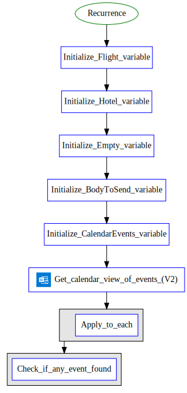
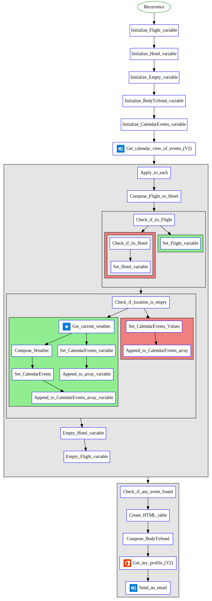

# Flow Documentation \- Email me with a list of upcoming Calendar events

| Flow Name                  | Email me with a list of upcoming Calendar events |
| -------------------------- | ------------------------------------------------ |
| Flow Name                  | Email me with a list of upcoming Calendar events |
| Flow ID                    | e6b4e32f\-c97d\-4280\-896b\-57976ea698e3         |
| Documentation generated at | Wednesday, 30 November 2022 10:33 am             |
| Number of Variables        | 5                                                |
| Number of Actions          | 28                                               |

- [Overview](index-Email-me-with-a-list-of-upcoming-Calendar-events(e6b4e32f-c97d-4280-896b-57976ea698e3).md)
- [Connection References](connections-Email-me-with-a-list-of-upcoming-Calendar-events(e6b4e32f-c97d-4280-896b-57976ea698e3).md)
- [Variables](variables-Email-me-with-a-list-of-upcoming-Calendar-events(e6b4e32f-c97d-4280-896b-57976ea698e3).md)
- [Triggers & Actions](triggersactions-Email-me-with-a-list-of-upcoming-Calendar-events(e6b4e32f-c97d-4280-896b-57976ea698e3).md)

## Flow Overview

The following chart shows the top level layout of the Flow. For a detailed view, please visit the section called Detailed Flow Diagram

## Detailed Flow Diagram

The following chart shows the detailed layout of the Flow

