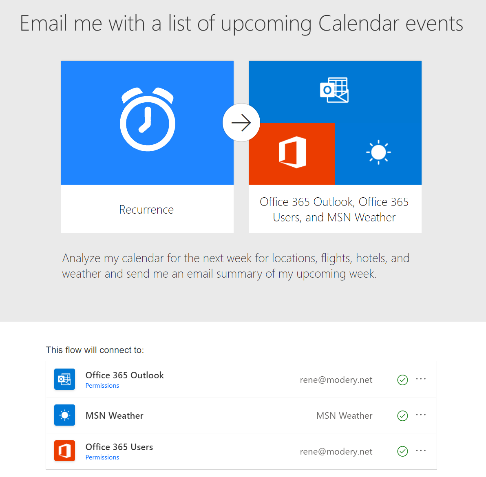
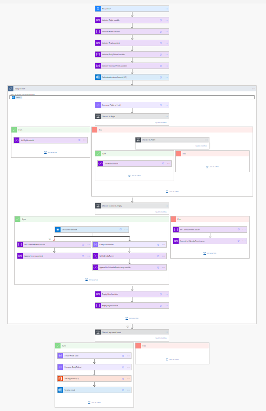
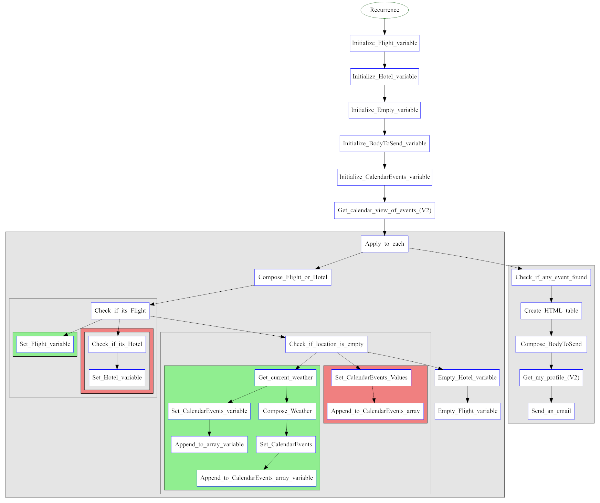
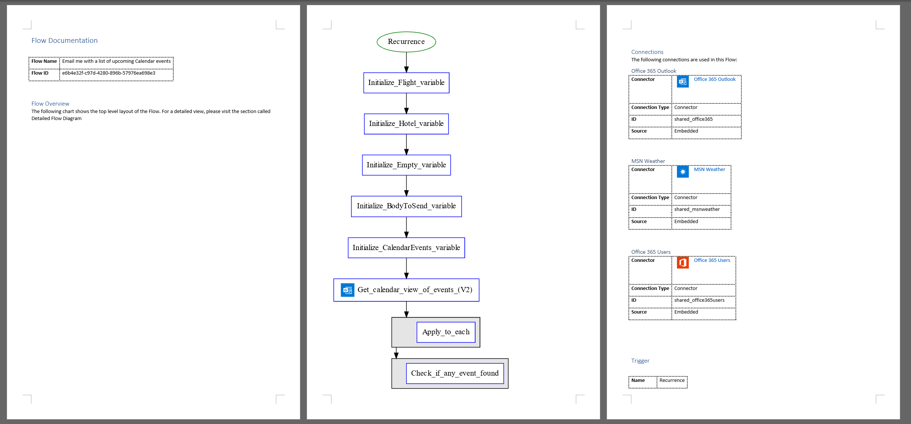
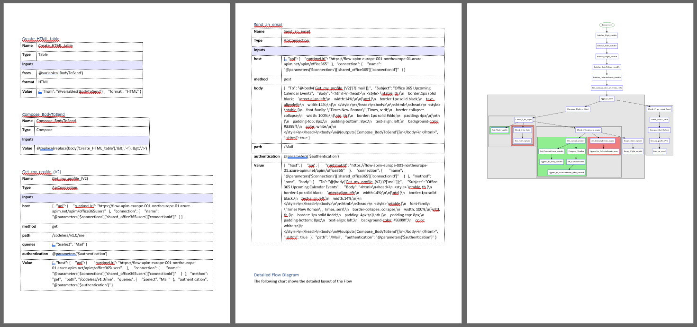

# Examples of PowerDocu FlowDocumenter

## Template: Email me with a list of upcoming Calendar events
The freely available template [Email me with a list of upcoming Calendar events](https://emea.flow.microsoft.com/en-us/galleries/public/templates/99892410786e4d6888f27ae380125a80/email-me-with-a-list-of-upcoming-calendar-events/) uses 3 different connectors and a few actions, including some control actions.

Within Power Automate, the Flow's layout looks as follows:

FlowDocumenter's generated diagram for the Flow looks as follows:

Here is an extract of the generated Word documentation:

The generated Word documentation for *Email me with a list of upcoming Calendar events* can also be downloaded here: [Email me with a list of upcoming Calendar events](Email%20me%20with%20a%20list%20of%20upcoming%20Calendar%20events.docx)
