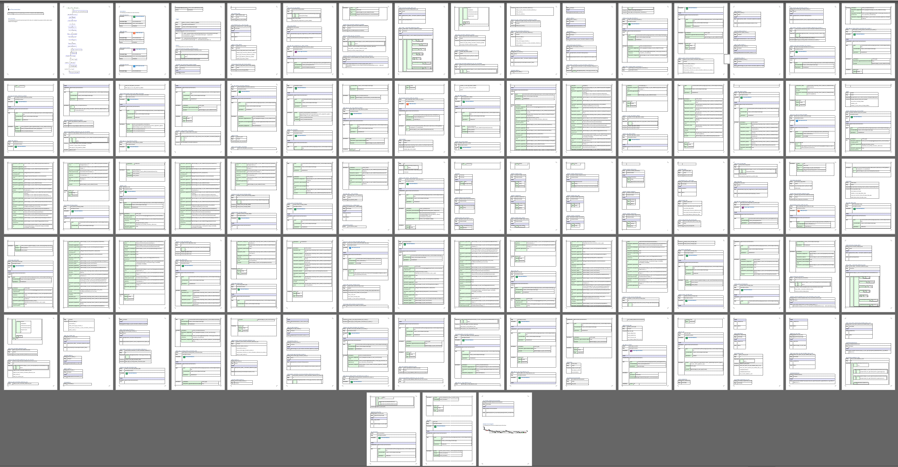
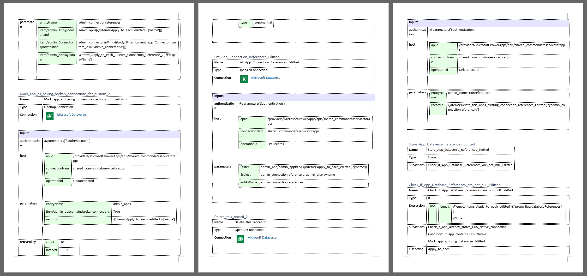

# Examples of PowerDocu FlowDocumenter

## Template: Email me with a list of upcoming Calendar events
The freely available Power Automate Flow template [Email me with a list of upcoming Calendar events](https://emea.flow.microsoft.com/en-us/galleries/public/templates/99892410786e4d6888f27ae380125a80/email-me-with-a-list-of-upcoming-calendar-events/) uses 3 different connectors and a few actions, including some control actions.

Within Power Automate, the Flow's layout looks as follows:

FlowDocumenter's generated diagram for the Flow looks as follows:

Here is an extract of the generated Word documentation:

The generated Word documentation for *Email me with a list of upcoming Calendar events* can also be downloaded here: [Email me with a list of upcoming Calendar events](Email%20me%20with%20a%20list%20of%20upcoming%20Calendar%20events.docx)

## Template: Email me with a list of upcoming Calendar events
Microsoft provides the free [Microsoft Power Platform Center of Excellence (CoE) Starter Kit](https://github.com/microsoft/coe-starter-kit/). "The Center of Excellence (CoE) Starter Kit is a set of templates that are designed to help develop a strategy for adopting, maintaining and supporting the Power Platform, with a focus on Power Apps and Power Automate." Among other things, it contains a few Flows as part of various Solutions.

One of these solutions, [CenterofExcellenceCoreComponents_3.13_managed.zip](https://github.com/microsoft/coe-starter-kit/releases/tag/CoEStarterKit-October2021), has been processed through FlowDocumenter, and the documentation that has been generated is available here: [Solution CenterofExcellenceCoreComponents_3.13_managed](Solution CenterofExcellenceCoreComponents_3.13_managed.zip). 

An extract of the generated documentation of one of its Flows, AdminSyncTemplatev3Apps, is listed below. Its generated Word documentation is available here: [AdminSyncTemplatev3Apps.docx](AdminSyncTemplatev3Apps.docx)

Detailed Graph of the Flow

27 pages of generated documentation

Example of the documented actions

