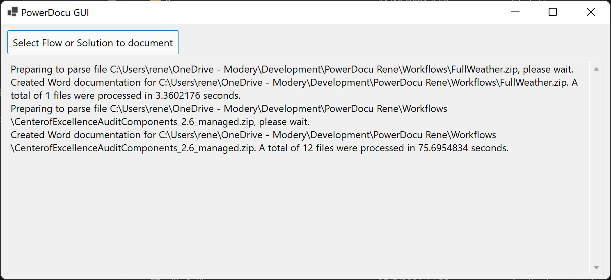
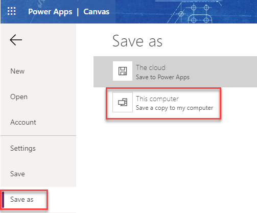

# PowerDocu Installation & Usage

## Requirements

PowerDocu is running on .NET on Windows

## Download the latest Release
Download the latest release from (https://github.com/modery/PowerDocu/releases). Currently, two versions are provided as part of the releases:
1. The default app that requires [.NET 5.0 to be installed](https://dotnet.microsoft.com/download)
2. The standalone package that contains everything you need to run it (including .NET Core runtime and libraries).

Alternatively, you can also download the current source code and compile it (e.g. in Visual Studio Code).

Run **PowerDocu.GUI.exe** to launch PowerDocu. If you run it for the first time, or generally if you want to ensure that you have the latest set of connector icons, press the green download icon in the top right corner to refresh your local copy of connector icons.

## Export the Flow, App, or Solution you want to document
To generate documentation for a Flow, you need to export it from the web as a ZIP package. 

1. Open your Flow's detail page
2. Select *Export Flow*

3. Provide a name for the file and export the package

To generate documentation for a Power Apps canvas app, you need to export it from the web as a .msapp package. 

1. Open your Power Apps canvas app
2. Select *File* and *Save As*, then choose *This Computer*

3. The exported package will be downloaded to your computer