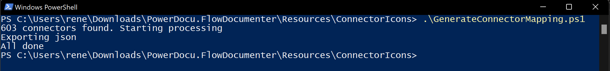
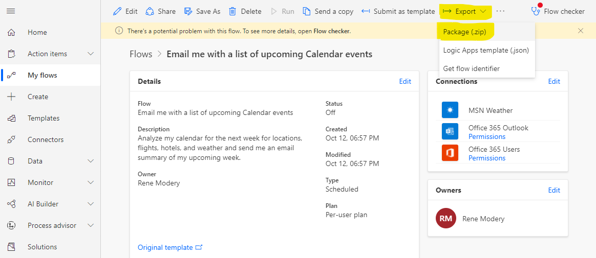
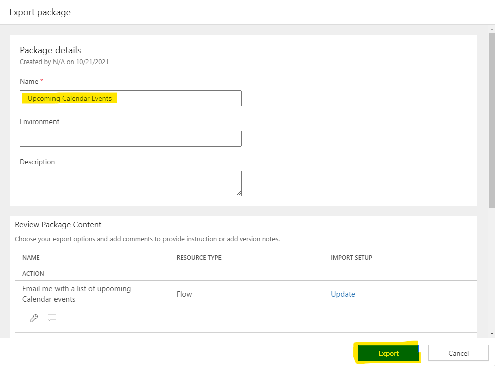
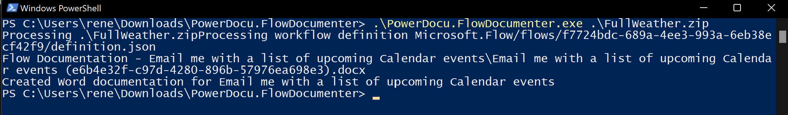
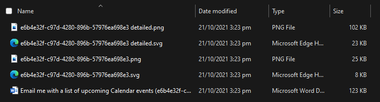
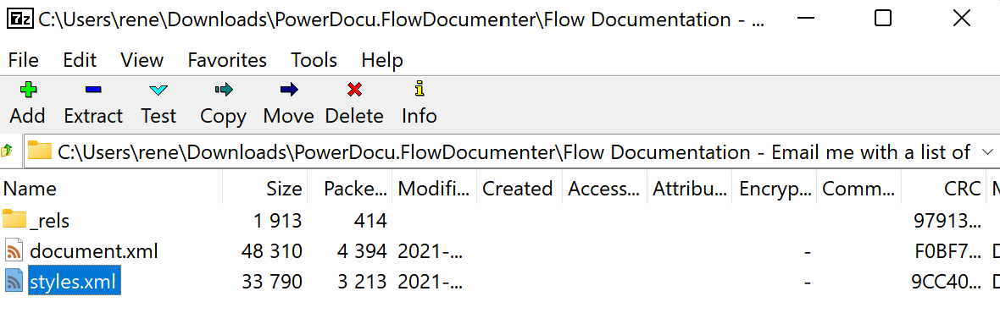

# PowerDocu FlowDocumenter Installation & Usage

Please review the steps below to start using **FlowDocumenter**. Also, please note that the current version has only been tested on Windows.

## Requirements

FlowDocumenter has been tested on Windows only. It is running on .NET 5.0

## Download the latest Release
Download the latest release from (https://github.com/modery/PowerDocu/releases). Currently, two versions are provided as part of the releases:
1. The default app that requires [.NET 5.0 to be installed](https://dotnet.microsoft.com/download)
2. The standalone package that contains everything you need to run it (including .NET Core runtime and libraries).

Alternatively, you can also download the current source code and compile it (e.g. in Visual Studio Code).

## Prepare the Connector Icons
By default, this solution contains some general information about the currently available connectors inside the **[Resources\ConnectorIcons\connectors.json](PowerDocu.Common\Resources\ConnectorIcons\connectors.json)** file. As there are regular updates to the set of connectors available, a script to get the latest set is provided. Running the script will regenerate the JSON file that contains the connector details, and it also downloads the connector icons (which will then be used inside the generated Word document).

To retrieve the latest list of connector details and icons, simply run the PowerShell script **GenerateConnectorMapping.ps1** inside the *Resources\ConnectorIcons* folder.

You do not need to run this script everytime before you generate documentation. After a first, initial run you would only need to run it again if there are new connectors available that you use inside your Flow.

## Export the Flow you want to documnent
To generate documentation for a Flow, you need to export it from the web as a ZIP package. 

1. Open your Flow's detail page
2. Select *Export Flow*

3. Provide a name for the file and export the package

## Run FlowDocumenter

Run FlowDocumenter by doing the following:

1. Open a command prompt or PowerShell window in the folder that contains FlowDocumenter
2. Execute FlowDocumenter and provide an exported Flow package as parameter. For example: *PowerDocu.FlowDocumenter.exe FlowPackage.zip*

3. A new folder will be created within the current folder, using the exported Flow's name as folder name. Inside this folder you can find the generated diagrams as well as the generated documentation

## Use custom Word style formatting

Inside the Resources folder, you can find a *styles.xml* file which provides the default styling options for the Headings used in the generated documentation. If wanted, you can replace it with your own version. If you have an existing Word document, open it as a ZIP archive (e.g. in 7-Zip), and extract the styles.xml found inside the folder *word*

